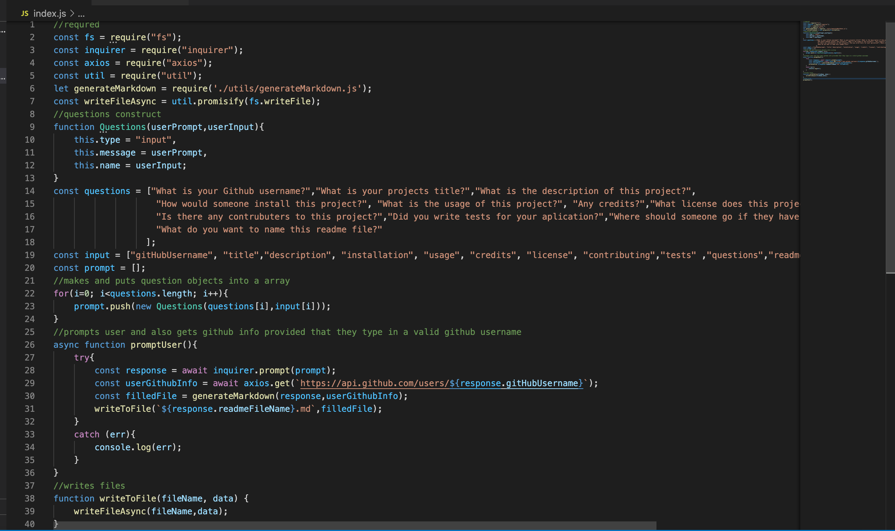
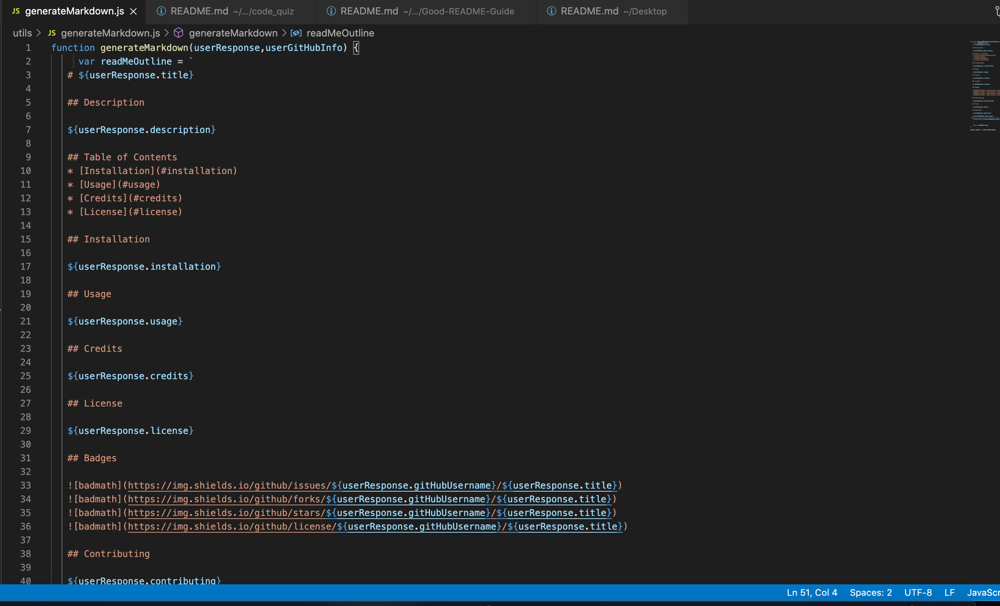

# good-readme-generator

## Description 
This project was a way for me to make the process of writing  a readme simpler by assisting and prompting me on what to include. Furthermore this program enables me to focus on the content of the readme rather than having to think about the formatting of the readme. This is beneficial because I already have a template of a readme that will be generated and I only have to write out the content of my projects. 

I achieved this readme generator by utilizing node.js as well as axios and inquire. Axios was used in order to call on the github api so that it could fill out the users contact information as well as display their github avatar. Inquire was utilized so that the project would have a clean and easy way of prompting the user. 

   

## Table of Contents
* [Installation](#installation)
* [Usage](#usage)
* [Credits](#credits)
* [License](#license)
   
## Installation

The installation of this project is to access my github repository and then click on good-readme-generator or click this link [Good-readme-generator](https://github.com/hondahelix/good-readme-generator) then click on the green code button in the top right corner. Then you can copy and paste the code via ssh or by downloading a zip file. Once you have downloaded the file there are a couple of things that must be downloaded in order for this application to run properly. The first is node.js once this is downloaded open up the terminal and navigate to the file that this project is saved in. Then run the code:
npm i 
This should download axios and inquire. Then all that is left to do is run the command:
node index.js 
Then you will be prompted with some questions in order to fill out the read me.

## Usage 

The usage of this project is to enable the user to be able to generate a good readme with a simple line of code which then enables the user to fill out information about their projects.

                        Code in index.js

                        Code in generateMarkdown.js

   
## Credits

Third party applications and instruction was provided by the University of California Berkeley' full stack Coding Bootcamp program as well as the utilization of node.js, axios, and inquirer  

[UCB Coding Bootcamp](https://bootcamp.berkeley.edu/coding/)   
[Node.js](https://https://nodejs.org/en/)   
[Axios](https://www.npmjs.com/package/axios)   
[Inquirer](https://www.npmjs.com/package/inquirer)   

## License

 MIT

## Badges

   

## Questions

Hondahelix@gmail.com
   

   